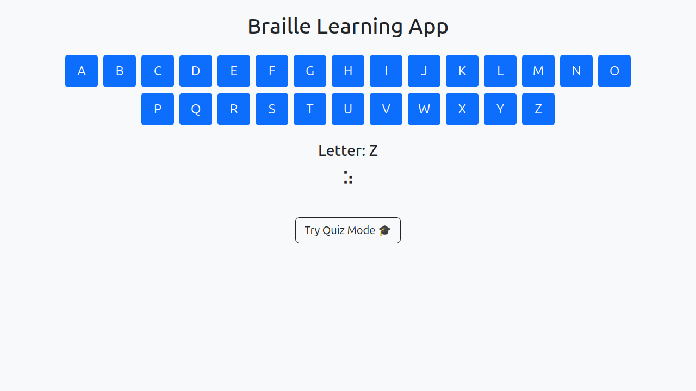
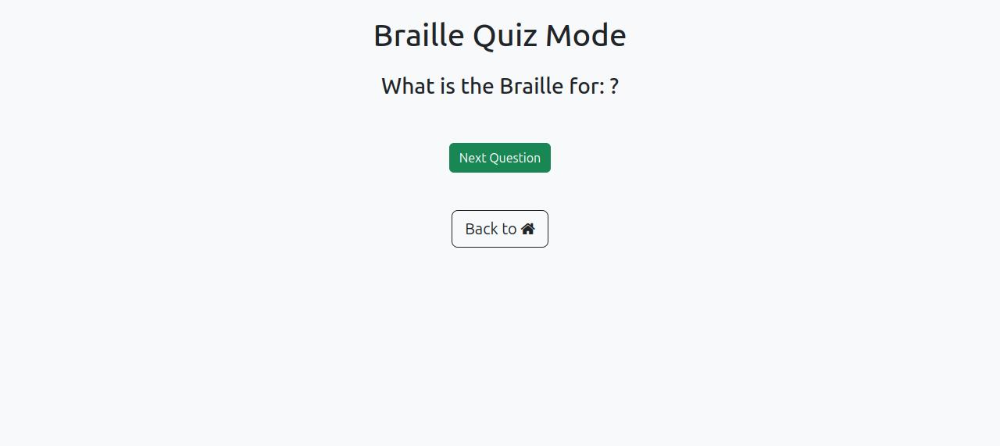

# DOTSight 🟣

A **Braille learning and quiz tool** designed to help visually impaired users learn and practice Braille characters using audio and visual feedback.

Built with **HTML, CSS (Bootstrap)** and **JavaScript** — no frameworks, just clean vanilla code and big accessibility vibes.

---

## 🔍 Features

- 📖 **Learning Mode**: Click on any letter to hear its name and see the Braille representation.
- 🧠 **Quiz Mode**: Test your knowledge! Get a random letter and pick the correct Braille symbol.
- 🔊 **Text-to-Speech** feedback using `speechSynthesis` API.
- 🎨 **Simple and accessible** UI built with Bootstrap.
- ♿️ Designed with accessibility in mind (keyboard-friendly, screen-reader compatible improvements incoming).

---

## 🧪 How to Use

1. Open `index.html` to access Learning Mode.
2. Click on **"Try Quiz Mode"** to open the quiz in `quiz.html`.
3. Select a Braille option and get instant audio feedback!

---

## 🌱 Tech Stack

- HTML5
- CSS3 (Bootstrap 5.3)
- JavaScript (Vanilla)

---

## 💡 Future Features

- 🔁 Braille to Letter quiz mode (reverse practice)
- 🧑‍🦯 Full screen reader support and ARIA accessibility
- 📊 Score tracking and progress memory with `localStorage`
- 🧩 Expandable modules for numbers, punctuation, contractions (Grade 2 Braille)

---

## 🧠 Why This Project?

Blind and visually impaired learners often lack accessible, interactive digital tools. DOTSight is a step toward inclusive tech — blending sight, sound, and simple design to make Braille education approachable for everyone.

---

## 📸 Preview

---

## 👨🏾‍💻 Developer

**Olateju** — Computer Science student, software engineer in training, and accessibility-minded dev building tech that *sees the unseen*.(small joke there)

GitHub: [https://github.com/tejHacks/](https://github.com/tejHacks)

---

